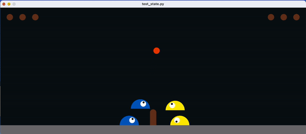

# Credits

This is a extension of [slimevolleygym by hardmaru](https://github.com/hardmaru/slimevolleygym) with addition of multiple agents. 

The aim of this project is to achieve collaborative behaviour between slimes on each team, since the current implementation relies on the same baseline policy for each agent (mirrored across the net).

# Installation

This is a working combination of dependencies for test_state.py. 

- gym                0.19.0
- pyglet             1.5.27
- numpy              1.25.0

To install dependencies, run 

```
pip install -e .
```

or

```
pip install <package_name>==<package_version>
```

To run the game with two agents on each side, type:
```python
python test_state.py
```

## Gym Version Issues

Depending on your installation method (pip), it might be necessary to install gym 0.19.0 manually. If pip is raising errors or installing the wrong version of gym, try [downloading gym 0.19.0 from pypi.org](https://pypi.org/project/gym/#history). 

Then, edit extras_require as shown in setup.py:

```python
extras_require={
    "extras": extras,
}
```

and then run:

```
python setup.py install --user
```

# What's New?

For now, agents have been modified to have different traits when unbalanced_traits is set to true in the Game class. 

Each slime can be controlled manually, using a set of 3 keys:

| Agent                | Unbalanced Mode     | Controls (Jump, Left, Right)|
| -------------------- | ------------------- | --------------------------- |
| agent_left           | speedy_x            | WAD                         |
| agent_left_2         | high_jump, slow_x   | TFH                         |
| agent_right          | speedy_x            | UP, LEFT, RIGHT             |
| agent_right_2        | high_jump, slow_x   | IJL                         |

